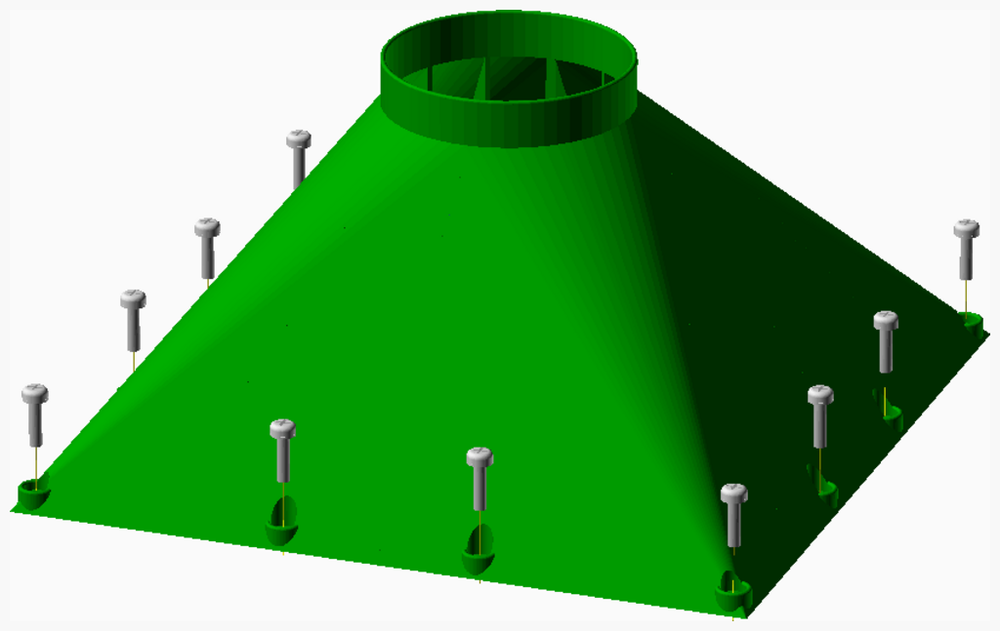

# DIYVent
This is a vent cover for a 100mm exhaust hose.

---
## Table of Contents
1. [Parts list](#Parts_list)
1. [Main Assembly](#main_assembly)

[Top](#TOP)

---

## Parts list
| Main | TOTALS |  |
|---:|---:|:---|
|  | | **Vitamins** |
| &nbsp;&nbsp;12&nbsp; |  &nbsp;&nbsp;12&nbsp; | &nbsp;&nbsp; Screw M5 pan x 20mm |
| &nbsp;&nbsp;12&nbsp; |  &nbsp;&nbsp;12&nbsp; | &nbsp;&nbsp; Washer  M5 x 10mm x 1mm |
| &nbsp;&nbsp;24&nbsp; | &nbsp;&nbsp;24&nbsp; | &nbsp;&nbsp;Total vitamins count |
|  | | **3D printed parts** |
| &nbsp;&nbsp;4&nbsp; |  &nbsp;&nbsp;4&nbsp; | &nbsp;&nbsp;vent_corner.stl |
| &nbsp;&nbsp;4&nbsp; | &nbsp;&nbsp;4&nbsp; | &nbsp;&nbsp;Total 3D printed parts count |

[Top](#TOP)

---

## Main Assembly
### Vitamins
|Qty|Description|
|---:|:----------|
|12| Screw M5 pan x 20mm|
|12| Washer  M5 x 10mm x 1mm|

### 3D Printed parts

| 4 x vent_corner.stl |
|---|
|  

### Assembly instructions

Glue all four corners of the vent cover together 
Screw the cover against the wooden frame 

[Top](#TOP)
